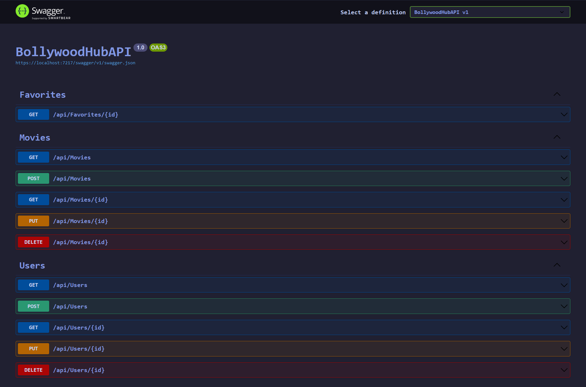
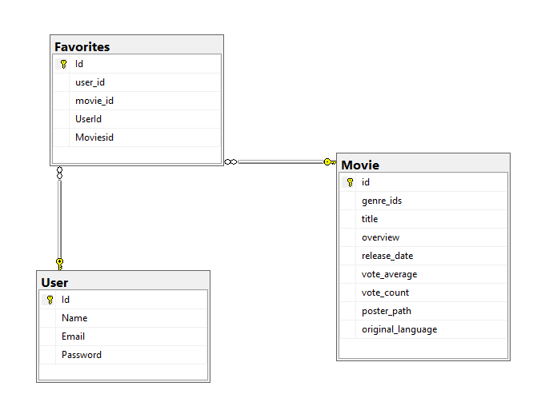

# BollywoodHub

This project was generated with [Angular CLI](https://github.com/angular/angular-cli) version 17.3.8.
&
Visual Studio 2022 with Net Framework 8.0

# Spring 4

* BollywoodHub
* Javier Montaño Rodriguez
* kitty_bug @ discord

## Description

Interactive Movie Hub that shows Bollywood movies that allows you to search and see in depth details of the all the titles with built-in login function that allows you to hide, favorite movies.

## Objective

Implement an API using C# with Net framework and SQL database, this will allowed in the future to have a much cleaner user experience (When it's finish!).

## Images of Project

## Instructions

When cloning this repository you must add the connection to your own SQL Server with the direction you wanna use for this API.

## How it was done

Since it was my first time working on C# and .Net Framework things didn't go smoothly but it's looking promising with the help of all the courses that Liderly provides us.

## Known Issues

Favorites is not functional yet, and some parts in the front-end still need some work because of the API changes. 

## Retrospective

| What was done well? | What can I do differently? | What didn't go well? |
------------------|----------------------------|-----------------------
| Route making and connecting everything to the project went really good. | Having a more clearer idea of how i want the database would have help | Favorites it's still not functional cause i'm still trying to understand how it should work.
