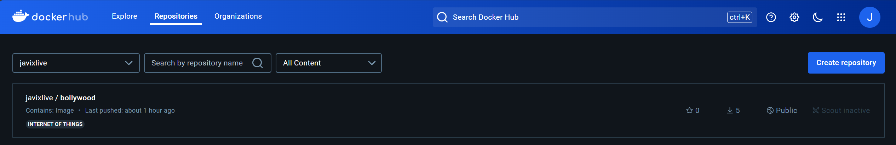

# BollywoodHub

This project was generated with [Angular CLI](https://github.com/angular/angular-cli) version 17.3.8.
Visual Studio 2022 with Net Framework 8.0
Microsoft SQL Server Management

# Sprint 6

* BollywoodHub
* Javier Montaño Rodriguez
* kitty_bug @ discord

## Description

Interactive Movie Hub that shows Bollywood movies that allows you to search and see in depth details of the all the titles with built-in login function that allows you to hide, favorite movies.

## Objective

Implementation of Docker + Kubernetes, ASP.NET, normalization of Database and Improvement of past work.

## Images of Project

## Instructions

When cloning this repository you must add the connection to your own SQL Server with the direction you wanna use for this API in the backend.
And make an environment variable on the front end that links to that one.

## How it was done

Most of the backend was done last Sprint so in this one, it was more of fixing error and adding missing features. 
Then with some research i was able to understand how to work with docker. And lastly Kubernetes was done with the help of the courses Liderly provided to me.

## Known Issues

Somethings might bug a little with the new changes on the backend, mostly on the favorites section and some details in the cards

## Retrospective

| What was done well? | What can I do differently? | What didn't go well? |
------------------|----------------------------|-----------------------
| Backend came out pretty smoothly. | More research on docker/kubernetes to make it look cleaner next time i work in this kind of projects. | Putting to work Docker with Kubernetes for the first time took some time to figure out on how to push my images to docker-hub so kubernetes didn't have trouble reading the image.