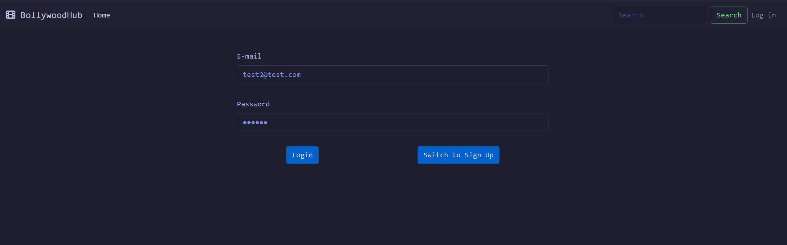
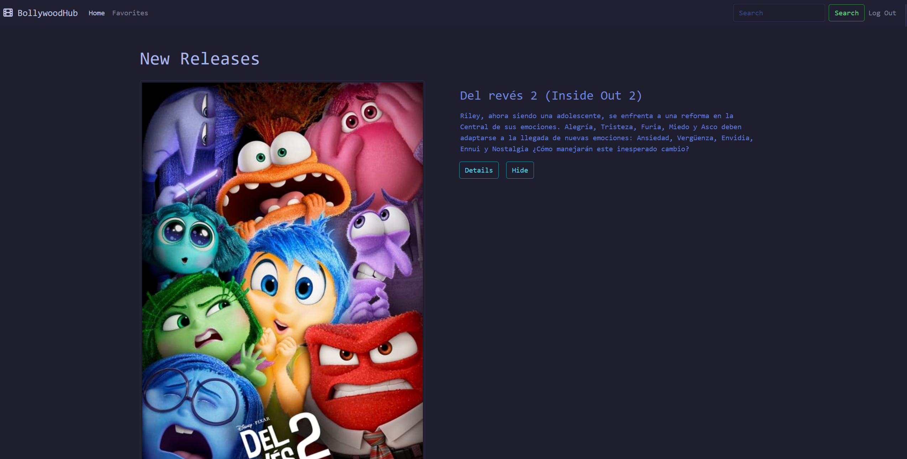
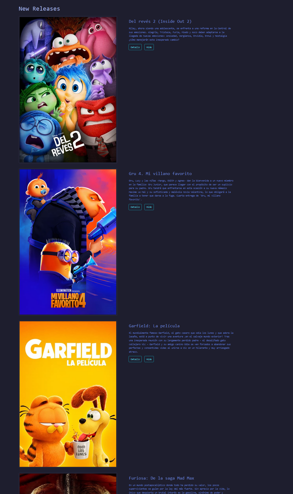
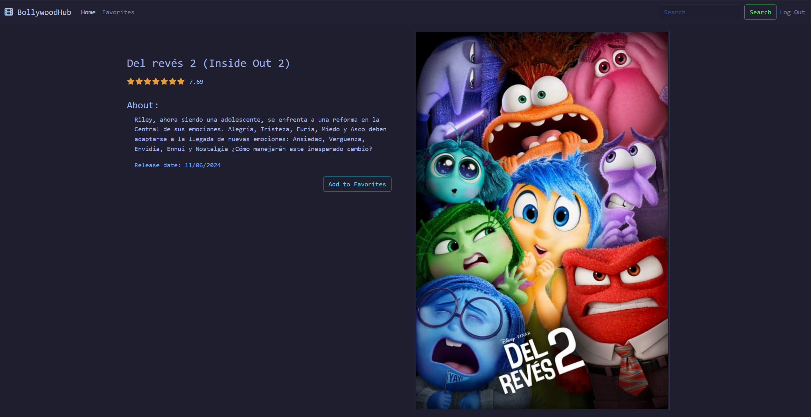
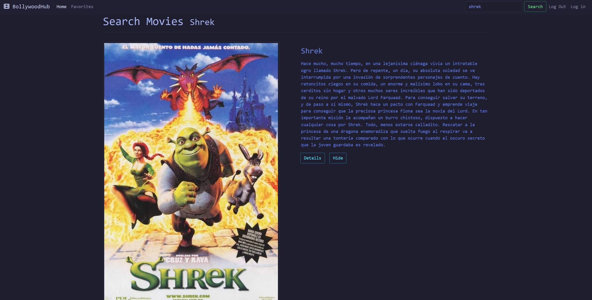
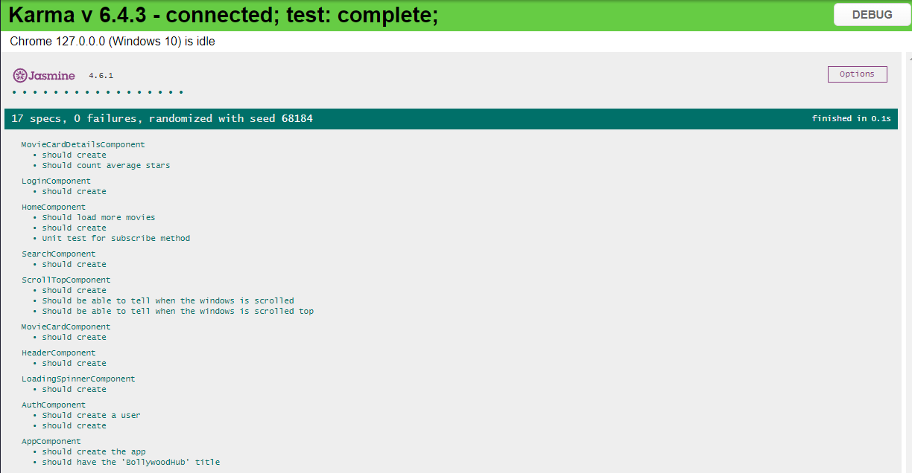
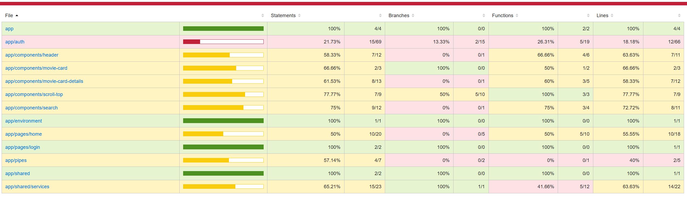

# BollywoodHub

This project was generated with [Angular CLI](https://github.com/angular/angular-cli) version 17.3.8.

# Spring 2 & 3

* BollywoodHub
* Javier Montaño Rodriguez
* kitty_bug @ discord

## Description

Interactive Movie Hub that shows Bollywood movies that allows you to search and see in depth details of the all the titles with built-in login function that allows you to hide, favorite movies.

## Objective

Learn and apply the use of Angular, TypeScript and Testing

## Images of Project

## Instructions

Run `ng build` to build the project. The build artifacts will be stored in the `dist/` directory.

Run `ng test` to execute the unit tests via [Karma](https://karma-runner.github.io).

Must create an `environment.ts` file with your own `Token Key Url` in order to work.

## How it was done

Since it was my first time working with angular I didn't know the best practices for creating a new project, hence the testing part of the app was a mess at the end when i got to that part and i will work on migrating the project to a more suitable environment.

Asides from that must of the stuff implemented was from the Liderly crash course on Angular, big help!

## Known Issues

Some stuff has issues with the new API 

## Retrospective

| What was done well? | What can I do differently? | What didn't go well? |
------------------|----------------------------|-----------------------
| Most things went really well for a first timer! | Create the project on a more efficient way that doesn't cause issues later on. | TESTS! and styles could be so much better with a bit more time.
